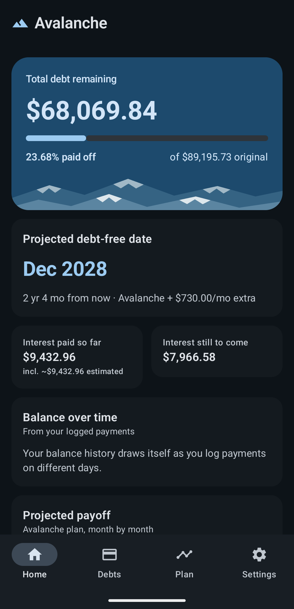
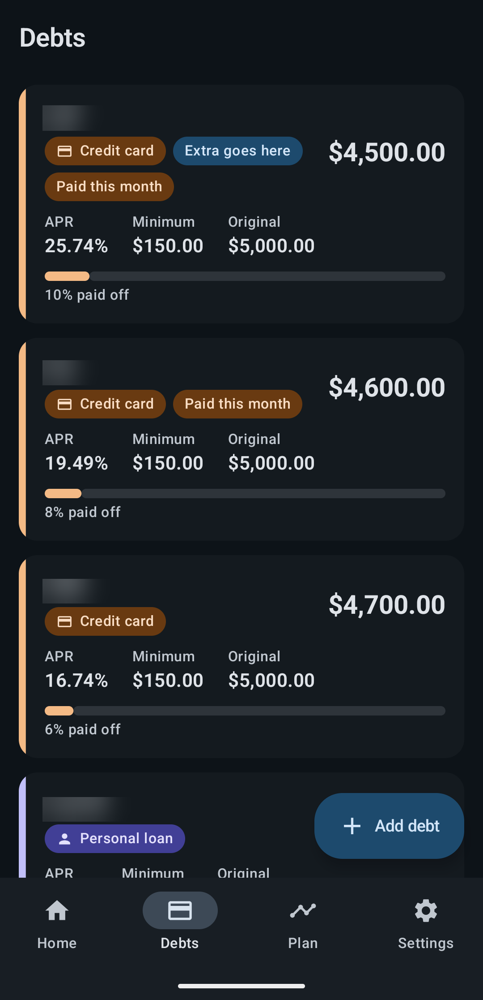
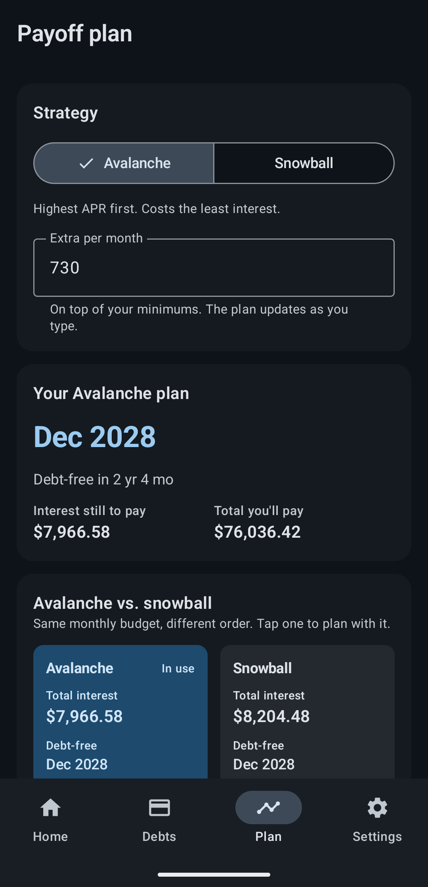
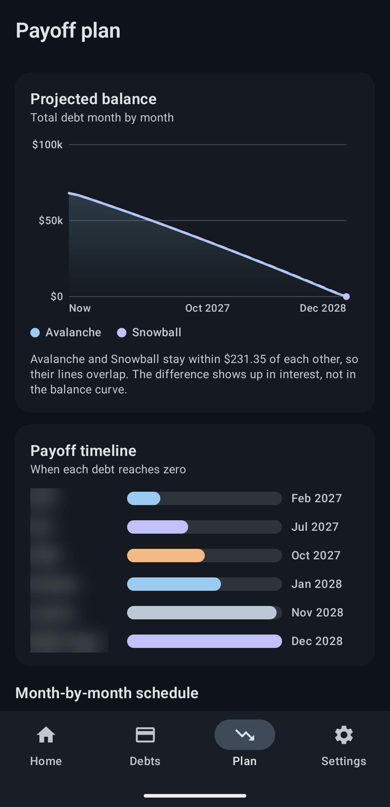
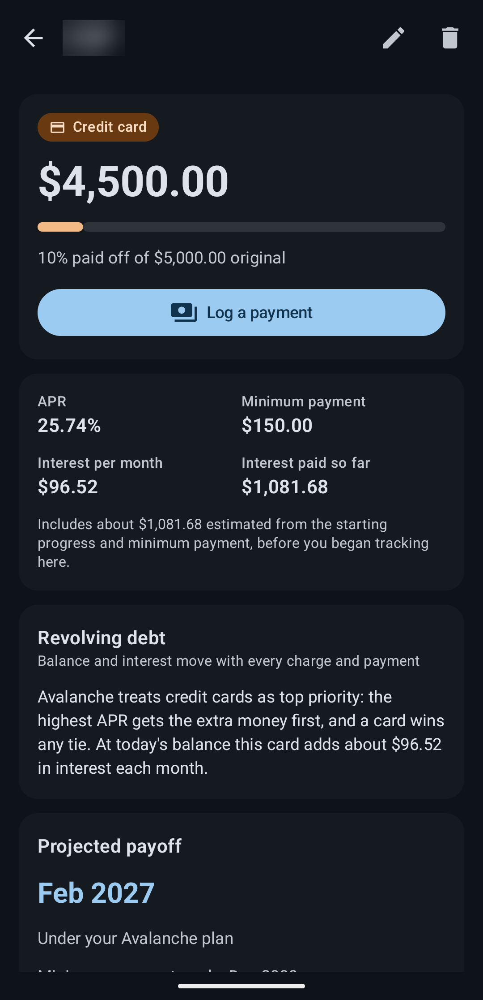

# Avalanche

A personal debt payoff tracker for Android. Fully offline: no account, no INTERNET
permission, no telemetry. Everything lives in a local Room (SQLite) database, and
there is no seed or demo data — it starts empty and every total, plan and chart is
derived at runtime from whatever debts you add.

Four bottom-nav tabs — **Home**, **Debts**, **Plan**, **Settings** — swipeable as
well as tappable (dark theme, Pixel 7 Pro):

| Home                                                                                         | Debts                                                                                                                              | Plan                                                                                           | Charts                                                                                             | Debt detail                                                                                    |
| -------------------------------------------------------------------------------------------- | ---------------------------------------------------------------------------------------------------------------------------------- | ---------------------------------------------------------------------------------------------- | -------------------------------------------------------------------------------------------------- | ---------------------------------------------------------------------------------------------- |
|                                                  |                                                                                           |                                                       |                               |                                                |
| Total remaining, progress, the projected debt-free date, and interest paid vs. still to come | Every debt as a card, revolving and installment tinted apart, tagged with where the extra goes and what is already paid this month | Avalanche or snowball, your extra per month, and a tappable side-by-side comparison of the two | Projected balance for both strategies, and a payoff timeline sorted by when each debt reaches zero | Balance and progress, interest paid so far (with an estimate), log a payment, projected payoff |

## Requirements

* A recent Android Studio (one that supports AGP 9.4)
* JDK 17 or newer
* Android SDK with API 36 installed
* Runs on **Android 8.0 (API 26)** and up; compiled and targeted against **API 36**

## Setup

1. Clone the repo and open it in Android Studio (or build from the command line).
2. Android Studio creates `local.properties` (with `sdk.dir`) automatically. There
   are no API keys, accounts or other secrets to configure.
3. Build & run:

   ```bash
   ./gradlew :app:assembleDebug        # build the APK
   ./gradlew :app:assembleRelease      # R8-shrunk release APK (debug-signed, see below)
   ./gradlew :app:installDebug         # install on a running device/emulator
   ./gradlew :app:testDebugUnitTest    # JVM unit tests
   ./gradlew :app:connectedDebugAndroidTest   # instrumented + Compose UI tests (needs a device)
   ./gradlew :app:lintDebug            # Android lint
   ```

   Run the instrumented tests on an emulator, not a phone with data you care
   about: Android's test runner uninstalls the app afterwards, which also removes
   its data. With several devices attached, pin the target with
   `ANDROID_SERIAL=<emulator-id>`. Debug builds install as `com.avalanche.app.debug`,
   so they sit next to a release build instead of replacing it.

### First run

1. The first launch shows the empty state → **Add your first debt**. Pick a type,
   enter the balance, APR and minimum payment.
2. Already been paying it down? Fill in **Already paid off (%)** (up to two
   decimals) and progress starts there; the interest paid on the way is estimated.
3. Made this month's payment already? Tick **This month's payment is already
   made** so the plan doesn't count it twice.
4. Open the **Plan** tab: pick avalanche or snowball, add an extra amount per
   month, and see the debt-free date, the side-by-side comparison, the payoff
   timeline and the month-by-month schedule.
5. Log payments as you make them (one payment can be split across several debts);
   balances, interest and the projections update.

## Features

* **Debts** — add / edit / delete credit cards, personal, student and auto loans,
  medical and other debt. Revolving debt (credit cards) and installment loans are
  set apart by colour *and* icon, and the avalanche order breaks APR ties in favour
  of the card.
* **Payment logging** — one payment session can be split across several debts.
  Each payment is split into interest and principal using simple daily interest,
  and the latest entry per debt can be undone.
* **Payoff plan** — month-by-month schedule under **avalanche** (highest APR
  first) or **snowball** (smallest balance first), on a fixed monthly budget with
  minimums that roll over as debts clear. Both are shown side by side; tap either
  box to plan with it. See [How the numbers work](#how-the-numbers-work).
* **One-time lump sum** — auto-applied to the highest APR or aimed at a chosen
  debt, with a preview of the months and interest it saves; it can be logged as a
  real payment from there.
* **Interest tracking** — interest paid so far (logged payments plus an estimate
  for the time before you started tracking) and interest still to come.
* **Charts** — balance history and projected balance, and a payoff timeline sorted
  by when each debt reaches zero, all drawn on a Compose `Canvas` (no chart library).
* **Already-paid months** — a debt whose payment for the month is already made
  (logged, or ticked by hand) takes no second minimum in the schedule.
* **Notifications** — an optional monthly reminder and a celebration when a debt
  reaches zero. Both are scheduled on the device.
* **Settings** — currency, notification switches, JSON **export / import** of
  everything through the system file picker, and a delete-everything option.
* **Swipeable tabs** — the four top-level screens live in a `HorizontalPager`
  behind the bottom bar, so a swipe and a tap move between them in sync.
* **Offline** — no network code at all.

## Architecture

MVVM + a repository layer, coroutines / `StateFlow` throughout, single-Activity
Compose with Compose Navigation. Room is the single source of truth and the UI only
ever observes it. Dependencies are wired by hand in a small `AppContainer`; the app
is small enough that a DI framework isn't worth its weight.

```
app/src/main/java/com/avalanche/app/
  AvalancheApplication.kt   Application + AppContainer (manual DI)
  data/         Room entities + DAOs, AppDatabase (v4, with migrations), DebtRepository,
                SettingsStore (SharedPreferences), JSON Backup
  domain/       Pure Kotlin, unit tested: PayoffCalculator, PaymentMath,
                PaidThisMonth, Summary (totals, balance history, interest estimate)
  notifications/  Channels, payoff celebration, monthly reminder (WorkManager) + its timing rule
  ui/
    AppNav.kt   NavHost; the four tabs are pages of one HorizontalPager, and
                Debt detail / Edit / Log payment are pushed routes on top
    theme/      Glacier palette (light + dark), kind colours
    components/ Shared Compose: cards, charts (Canvas), fields, dialogs
    dashboard/ debts/ payments/ plan/ settings/   one package per screen (ViewModel + Screen)
  util/         Money / date formatting and decimal input parsing
```

### Stack

| Concern         | Choice                                                                                                                      |
| --------------- | --------------------------------------------------------------------------------------------------------------------------- |
| Language        | Kotlin                                                                                                                      |
| UI              | Jetpack Compose + Material 3, glacier palette (light + dark), Compose Navigation, four swipeable tabs behind the bottom bar |
| Architecture    | MVVM + Repository, unidirectional `StateFlow`, dependencies wired by hand in an `AppContainer`                              |
| Persistence     | Room (schema v4, exported schemas, tested migrations); SharedPreferences for settings                                       |
| Background work | WorkManager (the optional monthly reminder check)                                                                           |
| Charts          | Compose `Canvas` (balance history, projected balance, payoff timeline) - no chart library                                   |
| Backup          | Gson JSON through the system file picker                                                                                    |
| Tests           | JUnit, Room `MigrationTestHelper`, Compose UI tests                                                                         |

`applicationId` / `namespace` = `com.avalanche.app` (debug build is `.debug`).
`minSdk 26`, `compileSdk` / `targetSdk 36`.

### Toolchain

|                       | Version                |
| --------------------- | ---------------------- |
| Android Gradle Plugin | 9.4.0                  |
| Gradle wrapper        | 9.6.0                  |
| Kotlin                | 2.2.10 (kapt for Room) |
| Compose BOM           | 2025.08.00             |
| Room                  | 2.7.2                  |
| JDK                   | 17 or newer            |

Every library version is pinned in `gradle/libs.versions.toml`. Room's compiler
runs through kapt, which is why `gradle.properties` keeps a few AGP 9 opt-outs
(`android.builtInKotlin=false`, `android.newDsl=false`, …); moving Room to KSP
would let them go.

### How the numbers work

* **Payoff plan** — each month interest accrues (APR/12), every debt gets its
  minimum, then the rest of a fixed budget (sum of minimums + your extra) goes to
  debts in strategy order. A paid-off debt's minimum rolls into the pool, so the
  budget never shrinks: a debt you've cleared and logged as paid off keeps
  contributing its minimum to the budget (delete the debt if you don't want that).
  Month 1 is the current calendar month. A plan whose minimums don't cover the
  interest is reported as "not on track" instead of showing a bogus date.
* **Avalanche and snowball** — avalanche orders by APR, highest first, with
  revolving debt (credit cards) winning ties; snowball orders by smallest balance.
  Because both spend the same total each month, their balance curves nearly
  coincide; the difference is mostly in interest, which the comparison card shows.
* **Lump sum** — lands at the start of month 1, before interest. "Auto" aims it at
  the highest-APR debt regardless of the selected strategy; a specific debt gets
  it first, with any overflow going in avalanche order.
* **Logged payments** — split into interest and principal using simple daily
  interest at the debt's APR since the last payment (or since the debt was added
  or its balance last set). Payments cover interest first; a payment smaller than
  the accrued interest capitalises the shortfall; payments are capped at the payoff
  amount. A payment can't be dated before a debt's last entry (its previous
  payment, adjustment or rate change), because entries are applied in the order
  they're logged.
* **Progress** is measured against the original balance. By default that is the
  balance when the debt was added, but the optional **Already paid off (%)** field
  derives it as `current ÷ (1 − pct)` (4,200 at 30% paid means it started at
  6,000), so the card, detail screen and dashboard totals all start at that
  percentage. Percentages accept up to two decimals and are displayed rounded,
  never truncated.
* **Interest paid before you started tracking** is estimated when a percentage is
  given: the debt is replayed from its derived original balance, paying the
  minimum every month at the APR, until it reaches today's balance. The estimate
  is stored on the debt and shown as an estimate; it is good for fixed-payment
  loans and rough for credit cards, whose minimums shrink over time. If the
  minimum wouldn't have covered the interest, no estimate is made.
* **Editing a debt** — a typed balance means "as of today", so interest accrues
  from today (a statement figure already includes what's accrued). With no
  payments yet that is a correction and progress restarts from it; once payments
  exist it is recorded as an adjustment and the original balance only ever grows.
  Changing the APR first settles the interest accrued at the old rate into the
  balance and moves the accrual point to today (even when nothing had accrued,
  such as a 0% promo ending), so the new rate only applies from then on; each rate
  change is its own entry in the history. Undoing one puts the old APR back, and
  undo never overrides a later "already paid off" correction. APR differences
  below the form's three decimals aren't treated as rate changes.
* **This month's payment already made** — the plan starts in the current month, so
  a payment you've already made would otherwise be counted again. A debt counts as
  paid for the month when the payments you've logged this month cover its minimum,
  or when you tick the box on its form (the tick lasts only for that month). In
  month 1 only what is left of its minimum is scheduled (nothing once it's
  covered), and everything already paid this month comes out of that month's
  budget: part payments, and debts you've cleared this month, count too, so the
  same money is never spent twice (not even when a lump sum clears a debt whose
  payment was already made). Your extra money is separate: it still goes to
  whichever debt the strategy puts first, paid or not, less anything you already
  paid above the minimum. From month 2 everything pays normally.
* **Where extra money goes** (Plan screen) is the strategy's order, not the order
  debts finish; the payoff timeline below it is sorted by finish date. A small
  low-APR debt can be cleared by its own minimum long before a big high-APR one.

### Backup & restore

Settings → **Your data** exports every debt and payment plus the settings to a plain
JSON file through the system file picker (no storage permission needed), and
restores from one after a confirmation.

* **Format** — one JSON document with `app`, `version` and `exportedAt` headers.
  Fields added in later versions are optional, so older backups still import.
* **Restore replaces, and is all-or-nothing** — the whole file is validated first
  (right app, not from a newer version, no negative amounts, no duplicate ids, every
  payment pointing at a real debt) and only then are the tables replaced in one
  Room transaction. A rejected file changes nothing and says why. Files over 10 MB
  are refused.
* **Delete all data** — the same section can wipe every debt and payment in one
  transaction. The confirm button stays disabled until you type `DELETE` (any case),
  so a stray tap can't erase everything. Export a backup first if you might want it
  back.
* **Not covered** — automatic or cloud backup. `allowBackup` is off so Android
  doesn't copy the database anywhere, which means exporting a file is the only
  backup, and it is plain, unencrypted JSON.

### Reminders

The monthly reminder is a 6-hourly WorkManager check. It fires once per month on
your chosen day (from 9:00; if the phone missed the day it catches up later, but
never before 9:00), never for a day that had already passed when you switched it
on, and never twice in one month. If notifications are blocked when it's due it
tries again at the next check instead of skipping the month. Android 13+ asks for
notification permission when you switch notifications on.

### Permissions

The app itself asks only for `POST_NOTIFICATIONS`, and there is no `INTERNET`
permission. The WorkManager library merges in a few scheduling permissions of its
own (boot receiver, wake lock, foreground service, network state) that it uses to
run the reminder check.

## Theming

A glacier palette — blue-slate surfaces and snow-white text — in full light **and**
dark schemes, with revolving debt in warm orange and installment debt in indigo
(each with an icon, so colour is never the only cue). The adaptive launcher icon is
a mountain with an avalanche slide and a powder cloud, plus a `<monochrome>` layer
for Android 13+ themed icons; the notification icon is the mountain.

## Tests

Unit (`./gradlew :app:testDebugUnitTest`, 93 tests):

* `PayoffCalculatorTest` — amortisation maths, avalanche / snowball ordering and
  tie-breaks, minimums rolling over, lump sums, payoff-date ordering, the balance
  gap between strategies, a cleared debt's minimum staying in the budget, and the
  already-paid-month rules (no second minimum, part payments, interest still
  accrues, extra still follows the strategy, lump sums that clear a paid debt)
* `PaidThisMonthTest` — what counts as paid for a month: the tick, logged and part
  payments, debts cleared this month, month boundaries, adjustments and other
  debts' payments ignored
* `PaymentMathAndHistoryTest` — interest / principal split, capping, balance
  history, totals, the interest estimate and the backup format round trip
* `BackupTest` — the previous-APR and already-paid fields, and the import size limit
* `ImportPromptTest` — the import dialog only warns about replacing data when there is data
* `DeleteConfirmationTest` — the typed word matches whatever its case or surrounding
  spaces, and nothing else does
* `SettingsStoreTest` / `ReminderRuleTest` / `FormattersTest` — settings storage,
  the reminder timing rule, and number / date / decimal-input handling

Instrumented (`./gradlew :app:connectedDebugAndroidTest`, 69 tests):

* `DebtRepositoryTest` — the real repository on an in-memory Room database: payment
  splitting, undo, adjustments, rate changes (including a 0% promo ending),
  the percent-paid rules, rejected backdated payments, the already-paid marker, and
  export / import
* `MigrationTest` — real v1 → v2 → v3 → v4 data-survival checks against the exported
  schemas in `app/schemas`
* `ViewModelTest` — the edit form, payment form and plan view models: save errors,
  prefilling without rounding, the already-paid box, the extra-amount field, and whether
  Settings knows there is data to replace
* `DebtCardTest` / `ComparisonCardTest` — real Compose layout and touch input: three
  tags wrap without clipping the card, and tapping a strategy box selects it and is
  announced as a selected radio choice
* `ConfirmDialogTest` — the *Delete all data* confirm button stays disabled until
  `DELETE` is typed, does nothing while disabled, and Cancel never confirms

## Static analysis & performance

* **Android lint** (`./gradlew :app:lintDebug`) — no errors; the remaining notices
  are newer-dependency-version hints and the kapt-versus-KSP note.
* **Release build** — `assembleRelease` runs R8 with code and resource shrinking
  (`isMinifyEnabled` / `isShrinkResources`); the keep rules in `proguard-rules.pro`
  protect the backup format's field names. Signing is optional: with a
  `keystore.properties` in the project root (copy `keystore.properties.example`;
  it and `*.jks` / `*.keystore` are git-ignored) the release APK is signed with your
  own key, and without one it falls back to the debug key, so a fresh clone still
  builds an APK that installs as-is with
  `adb install app/build/outputs/apk/release/app-release.apk`. The debug key is for
  local use only, and it differs per machine, so an APK signed on another computer
  can't update the installed app: export a backup before switching keys or machines,
  because Android will make you uninstall first.

## Known limitations / TODO

* **Backups are manual** — there's no automatic or cloud backup, and `allowBackup`
  is off, so uninstalling deletes the data unless you exported a file first.
* **Backdated payments** aren't allowed before a debt's last entry; a forgotten
  payment from before then can't be entered. Replaying history in date order would
  lift that, at the cost of the simple "undo the latest entry" model.
* **Ticked minimum and logged payments** — if you tick "already made" *and* log
  further payments in the same month, the larger of the two counts as paid, not
  their sum.
* **Month rollover** — plans and paid-this-month flags are computed when the data
  changes, so a screen left open across midnight on the 1st keeps showing the
  previous month until something changes.
* **Estimates** — the interest paid before tracking began is an approximation
  (see above), and all projections assume you keep paying the same amounts.
* **Currency** — the currency setting changes how amounts are displayed; there is
  no conversion.
* **kapt** — Room still uses kapt (hence the AGP opt-outs above); KSP would be
  faster.
* **No CI** — a workflow running `testDebugUnitTest` + `lintDebug` + `assembleDebug`
  would catch regressions.

## Legal

Copyright (c) 2026 phxlin. All rights reserved.

Avalanche is a personal debt tracker, not financial advice. Payoff dates and
interest figures are projections and estimates, and real balances depend on your
lenders' statements.
